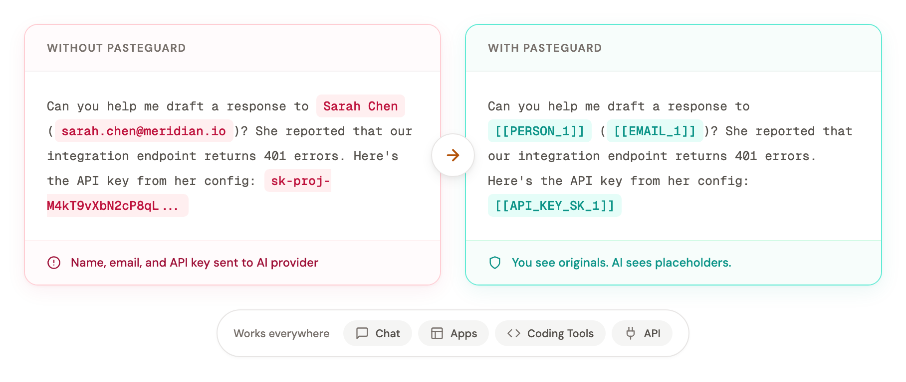
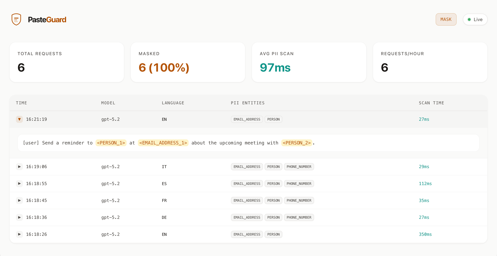

<p align="center">
  <picture>
    <source media="(prefers-color-scheme: dark)" srcset="assets/wordmark-dark.svg">
    <source media="(prefers-color-scheme: light)" srcset="assets/wordmark-light.svg">
    
  </picture>
</p>

<p align="center">
  <a href="https://github.com/sgasser/pasteguard/actions/workflows/ci.yml"></a>
  <a href="LICENSE"></a>
  <a href="https://github.com/sgasser/pasteguard/releases"></a>
</p>

<p align="center">
  <strong>AI gets the context. Not your secrets.</strong><br>
  Automatically hides names, emails, and API keys before you send prompts to AI.
</p>

<p align="center">
  <a href="#quick-start"><strong>Quick Start</strong></a> ·
  <a href="#chat"><strong>Chat</strong></a> ·
  <a href="#coding-tools"><strong>Coding Tools</strong></a> ·
  <a href="https://pasteguard.com/docs"><strong>Documentation</strong></a>
</p>

<br/>

<picture>
  <source media="(prefers-color-scheme: dark)" srcset="assets/comparison-dark.png">
  <source media="(prefers-color-scheme: light)" srcset="assets/comparison.png">
  
</picture>

<p align="center">
  Detects personal data and secrets in many languages.<br>
  Your data never leaves your machine.
</p>

## Works Everywhere

**[Chat](https://pasteguard.com/docs/use-cases/chat)** — Masks PII and secrets when you paste into ChatGPT, Claude, and Gemini. You see originals, AI sees placeholders.

**[Apps](https://pasteguard.com/docs/use-cases/apps)** — Open WebUI, LibreChat, or any self-hosted AI setup. Optionally routes sensitive requests to a local model.

**[Coding Tools](https://pasteguard.com/docs/use-cases/coding-tools)** — Cursor, Claude Code, Copilot, Windsurf — your codebase context flows to the provider. PasteGuard masks secrets and PII before they leave.

**[API Integration](https://pasteguard.com/docs/use-cases/api-integration)** — Sits between your code and OpenAI-compatible or Anthropic APIs. Change one URL, your users' data stays protected.

## Quick Start

Run PasteGuard as a local proxy:

```bash
docker run --rm -p 3000:3000 ghcr.io/sgasser/pasteguard:latest
```

Open [localhost:3000](http://localhost:3000) for the dashboard.

Point your tools or app to PasteGuard instead of the provider:

| Target | PasteGuard URL | Original URL |
|----------|----------------|--------------|
| OpenAI | `http://localhost:3000/openai/v1` | `https://api.openai.com/v1` |
| Anthropic | `http://localhost:3000/anthropic` | `https://api.anthropic.com` |
| Codex CLI | `http://localhost:3000/codex` | `https://chatgpt.com/backend-api/codex` |

```python
# One line to protect your data
client = OpenAI(base_url="http://localhost:3000/openai/v1")
```

Detection is multilingual out of the box — no per-language images or setup. For custom config or persistent logs: **[Read the docs →](https://pasteguard.com/docs/installation)**

<details>
<summary><strong>Route Mode</strong></summary>

Route Mode sends requests containing sensitive data to a local LLM (Ollama, vLLM, llama.cpp). Everything else goes to the configured cloud provider. Sensitive data stays on your network.

**[Route Mode docs →](https://pasteguard.com/docs/concepts/route-mode)**

</details>

## Chat

Open-source browser extension for ChatGPT, Claude, and Gemini.

- Paste customer data → masked before it reaches the AI
- AI responds with placeholders → you see the originals
- Works with the same detection engine as the proxy

Currently in beta. Apache 2.0.

**[Join the Beta →](https://tally.so/r/J9pNLr)** · **[Chat docs →](https://pasteguard.com/docs/use-cases/chat)**

## Coding Tools

Protect your codebase context and secrets when using AI coding assistants.

**Claude Code:**

```bash
ANTHROPIC_BASE_URL=http://localhost:3000/anthropic claude
```

**Cursor:** Settings → Models → Enable "Override OpenAI Base URL" → `http://localhost:3000/openai/v1`

**Codex CLI:** Configure a custom provider with `base_url = "http://127.0.0.1:3000/codex"`. See the coding tools docs for the full snippet.

**[Coding Tools docs →](https://pasteguard.com/docs/use-cases/coding-tools)**

## Dashboard

Every request is logged with masking details. See what was detected, what was masked, and what reached the provider.



[localhost:3000](http://localhost:3000)

## What it catches

**Personal data** — Names, locations, emails, phone numbers, credit cards, IBANs, IP addresses, and EU VAT numbers. Works in many languages.

**Secrets** — API keys (OpenAI, Anthropic, Stripe, AWS, GitHub), SSH and PEM private keys, JWT tokens, bearer tokens, passwords, connection strings.

Both detected and masked in real time, including streaming responses.

## How detection works

Detection runs as a separate service that PasteGuard calls over HTTP, so you can run it wherever you like. It mixes exact checks with checksums (IBANs, credit cards, emails, phones, IPs) and a small AI model ([GLiNER](https://github.com/urchade/GLiNER)) for names and places. It works the same in any language. Phone numbers are international-only by default; add `phone_regions` if you need local formats.

Code, Docker image, and tests are in [`detector/`](detector/).

## Tech Stack

[Bun](https://bun.sh) · [Hono](https://hono.dev) · [GLiNER](https://github.com/urchade/GLiNER) + [python-stdnum](https://arthurdejong.org/python-stdnum/) ([`detector/`](detector/)) · SQLite

## Contributing

See [CONTRIBUTING.md](CONTRIBUTING.md) for guidelines on how to contribute.

## License

[Apache 2.0](LICENSE)
